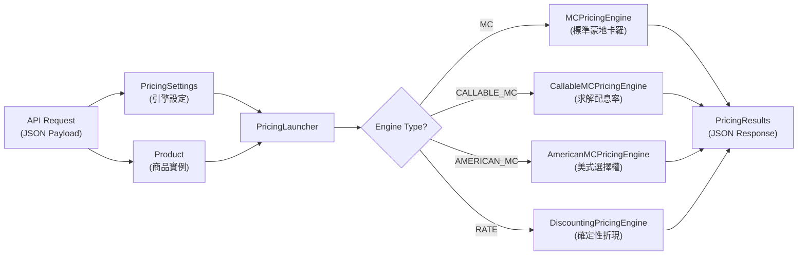

# 衍生性商品定價引擎 (Derivatives Pricing Engine)

這是一個基於 Python 的全功能定價引擎，支援蒙地卡羅模擬 (Monte Carlo Simulation)、多種隨機過程模型 (Black-Scholes, Heston) 以及多種波動度曲面 (SVI, SSVI, Local Volatility)。本引擎涵蓋廣泛的衍生性金融商品，包含香草選擇權 (Vanilla Options)、障礙選擇權 (Barrier Options)、路徑相關選擇權 (Path-Dependent Options)、美式/百慕大選擇權 (American / Bermudan Options)、選擇權策略 (Option Strategies)、結構型商品 (Structured Products，如 Autocall Phoenix / Eagle) 及利率商品 (Rate Products，如債券 Bond 與利率交換 Swap)，並計算相關的風險指標 (Greeks)。

此文件旨在為 Web 開發者、後端工程師及 DevOps 團隊提供**清晰的整合指南與輸出規格**，讓您可以獨立將此定價引擎與現有的系統 (API / Web App) 結合，而無須深入理解底層的財務數學。

---

## 1. 系統架構總覽 (System Architecture)

### 資料流程 (Data Flow)



### 核心設計理念 (Core Design Principles)

* **單一標的與多因子模擬 (Single Underlying with Multi-Factor Simulation):** 
  請注意，本定價引擎目前**僅支援單一標的資產 (Single Underlying)** 的定價（多資產關聯性模擬尚未支援）。然而，針對該單一標的，引擎支援最高雙因子 (Two-Factor) 的隨機過程模型。例如：在 Heston 模型下，系統底層會透過多型 (Polymorphic) 的 `SimulationResult` 資料容器，同時攜帶價格路徑 (`spot_paths`) 與變異數路徑 (`variance_paths`)，讓所有下游的奇異選擇權與結構型商品皆能無縫存取多維度狀態。

### 專案結構 (Directory Structure)

```
structured-products-engine-only/
├── kernel/                          # 核心定價邏輯 (Core Pricing Logic)
│   ├── market_data/                 # 市場資料層 (Market Data Layer)
│   │   ├── market.py                # Market 物件：殖利率曲線、波動度曲面、標的資產
│   │   ├── rate_curve_data/         # 利率曲線插值 (Svensson, Cubic)
│   │   ├── volatility_surface/      # 波動度曲面 (SVI, SSVI, Local Vol)
│   │   └── underlying_asset.py      # 標的資產資料
│   ├── models/
│   │   ├── pricing_engines/         # 四種定價引擎
│   │   ├── stochastic_processes/    # 隨機過程 (BS, Heston)
│   │   └── discretization_schemes/  # Euler 離散化
│   └── products/                    # 所有金融商品定義
│       ├── options/                 # 選擇權 (Vanilla, Barrier, Binary, Path-Dependent, American, Multi-Asset)
│       ├── options_strategies/      # 選擇權策略 (Straddle, Spread, Collar...)
│       ├── structured_products/     # 結構型商品 (Autocall, Participation)
│       └── rate/                    # 利率商品 (Bond, Swap)
├── utils/
│   ├── pricing_settings.py          # PricingSettings 設定類別
│   ├── pricing_results.py           # PricingResults 輸出類別
│   └── day_counter.py               # 日曆計息工具
├── data/                            # 市場資料檔案 (CSV)
│   ├── option_data/                 # 各標的之選擇權隱含波動率資料
│   ├── yield_curves/                # 殖利率曲線資料
│   └── underlying_data.csv          # 標的資產基本資料
└── examples.py                      # 範例執行腳本
```

---

## 2. 支援商品總覽 (Supported Product Catalogue)

本引擎支援以下所有商品類別。Web 團隊可依據此表建立 UI 表單欄位與 API 路由。

### 2.1 選擇權商品 (Options) — 引擎: `MC`

| 子分類 (Sub-category) | 類別名稱 (Class Name) | 參數 (Parameters) |
| :--- | :--- | :--- |
| **Vanilla (歐式)** | `EuropeanCallOption`, `EuropeanPutOption` | `maturity` (float), `strike` (float) |
| **Barrier (障礙)** | `UpAndOutCallOption`, `UpAndInCallOption`, `DownAndInCallOption`, `DownAndOutCallOption`, `UpAndInPutOption`, `UpAndOutPutOption`, `DownAndInPutOption`, `DownAndOutPutOption` | `maturity` (float), `strike` (float), `barrier` (float) |
| **Binary (二元/數位)** | `BinaryCallOption`, `BinaryPutOption`, `AssetOrNothingCallOption`, `AssetOrNothingPutOption` | `maturity` (float), `strike` (float), `coupon` (float, 僅 Binary) |
| **Path-Dependent (路徑相關)** | `AsianCallOption`, `AsianPutOption`, `LookbackCallOption`, `LookbackPutOption`, `FloatingStrikeCallOption`, `FloatingStrikePutOption` | `maturity` (float), `strike` (float) |
| **Forward Start (遠期起始)** | `ForwardStartCallOption`, `ForwardStartPutOption` | `maturity` (float), `forward_start_time` (float), `strike_percentage` (float, default=1.0) |
| **Chooser (選擇者)** | `ChooserOption` | `maturity` (float), `strike` (float), `chooser_time` (float) |
| **Multi-Asset (多標的)** | `BasketCallOption`, `BasketPutOption`, `BestOfCallOption`, `BestOfPutOption`, `WorstOfCallOption`, `WorstOfPutOption` | `maturity` (float), `strike` (float), `weights` (array, optional) — **TBD: 定價引擎尚未支援多資產關聯性模擬** |

### 2.2 美式/百慕大選擇權 (American / Bermudan Options) — 引擎: `AMERICAN_MC`

| 類別名稱 (Class Name) | 參數 (Parameters) |
| :--- | :--- |
| `AmericanCallOption`, `AmericanPutOption` | `strike` (float), `maturity` (float) |
| `BermudanCallOption`, `BermudanPutOption` | `strike` (float), `maturity` (float), `exercise_times` (List[float]) |

> [!NOTE]
> 美式與百慕大選擇權現已全面支援 `Model.HESTON`。引擎內部實作了先進的 **2-D Longstaff-Schwartz (LSM)** 演算法，採用 6 項擴展基底函數 ($1, S, S^2, v, v^2, S \cdot v$)，精準捕捉價格與波動度聯合動態下的提前履約價值。

### 2.3 選擇權策略 (Option Strategies) — 引擎: `MC`

| 策略名稱 (Strategy) | 類別名稱 (Class) | 參數 (Parameters) |
| :--- | :--- | :--- |
| 跨式策略 Straddle | `Straddle` | `maturity`, `strike`, `position_call` (bool), `position_put` (bool) |
| 勒式策略 Strangle | `Strangle` | `maturity`, `strike_put`, `strike_call`, `position_call`, `position_put` |
| 牛市價差 Bull Spread | `BullSpread` | `maturity`, `strike_low`, `strike_high`, `position_low`, `position_high` |
| 熊市價差 Bear Spread | `BearSpread` | `maturity`, `strike_low`, `strike_high`, `position_low`, `position_high` |
| 蝶式價差 Butterfly Spread | `ButterflySpread` | `maturity`, `strike_low`, `strike_mid`, `strike_high` |
| 兀鷹價差 Condor Spread | `CondorSpread` | `maturity`, `strike_low`, `strike_mid1`, `strike_mid2`, `strike_high` |
| 日曆價差 Calendar Spread | `CalendarSpread` | `strike`, `maturity_near`, `maturity_far` |
| 領口策略 Collar | `Collar` | `maturity`, `strike_put`, `strike_call` |
| Strip | `Strip` | `maturity`, `strike` |
| Strap | `Strap` | `maturity`, `strike` |

### 2.4 結構型商品 (Structured Products) — 引擎: `CALLABLE_MC` 或 `MC`

| 類別名稱 (Class) | 參數 (Parameters) |
| :--- | :--- |
| **Phoenix** | `maturity` (float), `observation_frequency` (ObservationFrequency), `capital_barrier` (float, %), `autocall_barrier` (float, %), `coupon_rate` (float, %), `coupon_barrier` (float, %), `is_security` (bool, 預設 false), `is_plus` (bool, 預設 false) |
| **Eagle** | `maturity` (float), `observation_frequency` (ObservationFrequency), `capital_barrier` (float, %), `autocall_barrier` (float, %), `coupon_rate` (float, %), `is_security` (bool, 預設 false), `is_plus` (bool, 預設 false) |
| **TwinWin** | `maturity` (float), `upper_barrier` (float), `lower_barrier` (float), `rebate` (float), `leverage` (float) — **TBD: 尚未完成向量化** |
| **Airbag** | `maturity` (float), `upper_barrier` (float), `lower_barrier` (float), `rebate` (float), `leverage` (float) — **TBD: 尚未完成向量化** |

> [!NOTE]
> Autocall 商品 (Phoenix / Eagle) 現已全面相容 `Model.HESTON`。在多因子路徑下，配息率求解器 (Solver) 依然能保持高效收斂。

### 2.5 利率商品 (Rate Products) — 引擎: `RATE`

| 類別名稱 (Class) | 參數 (Parameters) |
| :--- | :--- |
| **CouponBond** | `notional` (float), `issue_date` (datetime), `maturity` (datetime), `coupon_rate` (float), `frequency` (int), `calendar_convention` (CalendarConvention), `price` (float, optional), `ytm` (float, optional) |
| **ZeroCouponBond** | `notional` (float), `issue_date` (datetime), `maturity` (datetime), `calendar_convention` (CalendarConvention), `price` (float, optional), `ytm` (float, optional) |
| **InterestRateSwap** | `notional` (float), `issue_date` (datetime), `maturity` (datetime), `calendar_convention` (CalendarConvention), `frequency` (int), `fixed_rate` (float, optional — 若為 None 則引擎求解 Par Swap Rate), `float_spread` (float, 預設 0.0) |

---

## 3. 定價引擎設定 — 完整參數手冊 (PricingSettings Reference)

`PricingSettings` 是發送給 `PricingLauncher` 的設定物件。Web 端 API 可將以下欄位對應至 JSON Payload。

| 參數名稱 (Parameter) | 型別 (Type) | 預設值 (Default) | 說明 (Description) |
| :--- | :--- | :--- | :--- |
| `underlying_name` | `str` | `None` | 標的代碼 (例如 `"SPX"`)。決定引擎載入哪一組波動度曲面與標的資料。 |
| `rate_curve_type` | `RateCurveType` | `None` | 殖利率曲線類型。可選值：`RF_US_TREASURY`, `RF_OAT`, `SWAP_EURIBOR`, `SWAP_SOFR`, `OIS_SOFR`, `OIS_ESTER`, `CREDIT_IG`, `CREDIT_HY`。 |
| `interpolation_type` | `InterpolationType` | `None` | 殖利率曲線插值方法，例如 `CUBIC`, `SVENSSON`。 |
| `volatility_surface_type` | `VolatilitySurfaceType` | `None` | 波動度曲面模型：`SVI`, `SSVI`, `LOCAL`。 |
| `obs_frequency` | `ObservationFrequency` | `None` | 觀察頻率：`ANNUAL`=1, `SEMIANNUAL`=2, `QUARTERLY`=4, `MONTHLY`=12。 |
| `day_count_convention` | `CalendarConvention` | `None` | 日曆計息慣例：`ACT_360`, `ACT_365`, `ACT_ACT`, `THIRTY_360`。 |
| `model` | `Model` | `None` | 隨機過程模型：`BLACK_SCHOLES`, `HESTON`。 |
| `pricing_engine_type` | `PricingEngineType` | `None` | 定價引擎類型：`MC`, `CALLABLE_MC`, `AMERICAN_MC`, `RATE`。 |
| `nb_paths` | `int` | `None` | MC 模擬路徑數量。建議：開發測試 10,000 / 生產環境 50,000+。 |
| `nb_steps` | `int` | `None` | 每條路徑的時間步數。建議：250（約一年的交易日數）。 |
| `random_seed` | `int` | `4012` | 隨機數種子，確保結果可複現。 |
| `compute_greeks` | `bool` | `False` | 是否計算風險指標 (Delta, Gamma, Vega, Theta, Rho)。開啟後計算時間約為原來的 **6-7 倍**。 |
| `compute_callable_coupons` | `bool` | `False` | 是否開啟隱含配息率求解模式 (僅搭配 `CALLABLE_MC` 引擎)。 |
| `random_generator_type` | `str` | `"NUMPY"` | 亂數產生器：`"NUMPY"` (偽隨機) 或 `"SOBOL"` (準蒙地卡羅 QMC)。**使用 `"SOBOL"` 時，建議將 `nb_paths` 設為 2 的冪次 (如 8192 或 16384)，以發揮低差異序列 (Low-Discrepancy Sequence) 的最佳收斂效能。** |
| `valuation_date` | `datetime` | `None` | 估值日期覆寫 (主要用於利率商品)。 |

---

## 4. 兩種運作模式：定價 vs. 求解配息率 (Pricing vs. Solving Coupon)

Autocall 商品 (Phoenix / Eagle) 支援兩種操作模式：

### 模式 A：定價模式 (Pricing Mode)
給定配息率 → 計算商品理論價格。

```python
settings.pricing_engine_type = PricingEngineType.CALLABLE_MC  # 或 MC
settings.compute_callable_coupons = False

product = Phoenix(maturity=5, observation_frequency=ObservationFrequency.ANNUAL,
                  capital_barrier=60, autocall_barrier=100, coupon_rate=5.0, coupon_barrier=80)

result = launcher.calculate(product)
print(f"理論價格: {result.price}")  # e.g. 102.35
```

### 模式 B：求解配息率模式 (Solving Mode)
給定目標價格 (預設 100) → 反推隱含配息率。引擎預設使用**解析法 (Analytical)**：以兩個不同配息率試算價格後線性插值，僅需 2 次模擬（速度最快）。若插值誤差過大，可改用**二分搜尋法 (Bisection)**，在預模擬路徑上迭代最多 25 次，容差 1e-2。

```python
settings.pricing_engine_type = PricingEngineType.CALLABLE_MC
settings.compute_callable_coupons = True

product = Phoenix(maturity=5, observation_frequency=ObservationFrequency.ANNUAL,
                  capital_barrier=60, autocall_barrier=100, coupon_rate=0.0, coupon_barrier=80)

result = launcher.calculate(product)
print(f"隱含配息率: {result.coupon_callable}%")  # e.g. 7.82%
```

> [!TIP]
> 求解模式只需 **一次路徑模擬**（解析法）或複用同一批路徑（二分法），效能與單次定價相近。Web 端可將 `coupon_rate` 初始設為 `0.0`。

---

## 5. 輸出規格 (Output Specification — `PricingResults`)

當您呼叫 `launcher.calculate(product)` 後，引擎**一定會回傳一個 `PricingResults` 資料物件**。此輸出結構是**固定且解耦的 (Decoupled)**，只要讀取這個物件，您的 Web / API 邏輯就不會被底層引擎的升級所破壞。

### `PricingResults` Schema

| 屬性名稱 (Property) | 型別 (Type) | 何時有值 (When Populated) |
| :--- | :--- | :--- |
| `price` | `float` 或 `None` | MC / RATE 引擎下總是有值。Solving 模式下可能為 `None`（求解聚焦於配息率）。 |
| `greeks` | `Dict[str, float]` | 僅在 `compute_greeks = True` 時有值。Keys: `"delta"`, `"gamma"`, `"vega"`, `"theta"`, `"rho"`。 |
| `coupon_callable` | `float` 或 `None` | 僅在 `compute_callable_coupons = True` 且引擎為 `CALLABLE_MC` 時有值。 |
| `rate` | `float` 或 `None` | 僅在 `RATE` 引擎下有值。債券 → YTM (到期殖利率)、交換 → Par Swap Rate。 |
| `std_dev` | `float` 或 `None` | MC 引擎下提供蒙地卡羅標準誤差，用於信賴區間計算。`RATE` 引擎下為 `None`。 |
| `lower_bound` *(property)* | `float` 或 `None` | 95% 信賴區間下界：`price - 1.96 × std_dev`。需要 `price` 與 `std_dev` 均有值。 |
| `upper_bound` *(property)* | `float` 或 `None` | 95% 信賴區間上界：`price + 1.96 × std_dev`。需要 `price` 與 `std_dev` 均有值。 |

### 聚合多商品結果 (Aggregating Multiple Results)

處理選擇權策略或多腿組合時，可用 `get_aggregated_results()` 靜態方法將多個 `PricingResults` 的價格與 Greeks 加總：

```python
results_list = [launcher.calculate(leg) for leg in strategy_legs]
combined = PricingResults.get_aggregated_results(results_list)
print(combined.price)   # 總策略價值
print(combined.greeks)  # 各 Greek 加總
```

### JSON 回傳範例

```json
{
  "status": "success",
  "data": {
    "price": 102.241,
    "greeks": {
      "delta": -0.015,
      "gamma": 0.002,
      "vega": 0.125,
      "theta": -0.004,
      "rho": 0.030
    },
    "coupon_callable": null,
    "rate": null
  }
}
```

---

## 6. 程式碼範例 — 每種引擎各一 (Code Examples by Engine)

以下範例涵蓋六種常見情境，可直接複製執行。

### 範例 1：Autocall Phoenix — 求解隱含配息率 (CALLABLE_MC)
```python
from kernel.tools import ObservationFrequency, Model, CalendarConvention, RateCurveType
from kernel.models.pricing_engines.enum_pricing_engine import PricingEngineType
from kernel.products.structured_products.autocall_products import Phoenix
from kernel.market_data.market import Market
from kernel.market_data.data_loader import MarketDataLoader
from kernel.market_data.volatility_surface.enums_volatility import VolatilitySurfaceType
from kernel.market_data.rate_curve_data.enums_interpolators import InterpolationType
from utils.pricing_settings import PricingSettings
from kernel.pricing_launcher import PricingLauncher

settings = PricingSettings()
settings.underlying_name = "SPX"
settings.rate_curve_type = RateCurveType.RF_US_TREASURY
settings.interpolation_type = InterpolationType.SVENSSON
settings.volatility_surface_type = VolatilitySurfaceType.SVI
settings.day_count_convention = CalendarConvention.ACT_360
settings.obs_frequency = ObservationFrequency.ANNUAL
settings.model = Model.BLACK_SCHOLES
settings.pricing_engine_type = PricingEngineType.CALLABLE_MC
settings.compute_callable_coupons = True
settings.nb_paths = 50000
settings.nb_steps = 250

data_loader = MarketDataLoader()
underlying_df = data_loader.get_underlying_info(settings.underlying_name)
options_df    = data_loader.get_option_data(settings.underlying_name)
yield_df      = data_loader.get_yield_curve(settings.rate_curve_type.value)

market = Market(
    underlying_name=settings.underlying_name,
    yield_curve_data=yield_df,
    underlying_data=underlying_df,
    option_data=options_df,
    rate_curve_type=settings.rate_curve_type,
    interpolation_type=settings.interpolation_type,
    volatility_surface_type=settings.volatility_surface_type,
    calendar_convention=settings.day_count_convention,
    obs_frequency=settings.obs_frequency
)

launcher = PricingLauncher(pricing_settings=settings, market=market)

product = Phoenix(maturity=5, observation_frequency=ObservationFrequency.ANNUAL,
                  capital_barrier=60, autocall_barrier=100, coupon_rate=0.0, coupon_barrier=80)

result = launcher.calculate(product)
print(f"隱含配息率 (Implied Coupon): {result.coupon_callable}%")
```

### 範例 2：Autocall Eagle — 給定配息率定價 (MC)
```python
from kernel.products.structured_products.autocall_products import Eagle

# 承接範例 1 的 market / settings 物件
settings.pricing_engine_type = PricingEngineType.MC
settings.compute_callable_coupons = False
launcher = PricingLauncher(pricing_settings=settings, market=market)

product = Eagle(maturity=3, observation_frequency=ObservationFrequency.SEMIANNUAL,
                capital_barrier=70, autocall_barrier=105, coupon_rate=8.0)

result = launcher.calculate(product)
print(f"Eagle 理論價格: {result.price}")
```

### 範例 3：歐式 Call + Greeks (MC)
```python
from kernel.products.options.vanilla_options import EuropeanCallOption

settings.pricing_engine_type = PricingEngineType.MC
settings.compute_greeks = True
launcher = PricingLauncher(pricing_settings=settings, market=market)

spot = market.underlying_asset.last_price
product = EuropeanCallOption(maturity=1.0, strike=spot)
result = launcher.calculate(product)

print(f"權利金: {result.price}")
print(f"Delta: {result.greeks['delta']}, Gamma: {result.greeks['gamma']}")
print(f"Vega: {result.greeks['vega']}, Theta: {result.greeks['theta']}, Rho: {result.greeks['rho']}")
```

### 範例 4：障礙選擇權 — Down-and-In Call (MC)
```python
from kernel.products.options.barrier_options import DownAndInCallOption

settings.compute_greeks = True
launcher = PricingLauncher(pricing_settings=settings, market=market)

spot = market.underlying_asset.last_price
product = DownAndInCallOption(maturity=2.0, strike=spot, barrier=spot * 0.8)
result = launcher.calculate(product)

print(f"Down-and-In Call 價格: {result.price}")
print(f"Delta: {result.greeks['delta']}")
```

### 範例 5：美式 Put (AMERICAN_MC)
```python
from kernel.products.options.american_options import AmericanPutOption

settings.pricing_engine_type = PricingEngineType.AMERICAN_MC
settings.compute_greeks = False
launcher = PricingLauncher(pricing_settings=settings, market=market)

spot = market.underlying_asset.last_price
product = AmericanPutOption(strike=spot, maturity=1.0)
result = launcher.calculate(product)

print(f"美式 Put 價格: {result.price}")
```

### 範例 6：固定配息債券 — 從 YTM 求價格 (RATE)
```python
from datetime import datetime
from kernel.products.rate.bond import CouponBond
from kernel.tools import CalendarConvention

settings.pricing_engine_type = PricingEngineType.RATE
settings.valuation_date = datetime(2025, 6, 19)
launcher = PricingLauncher(pricing_settings=settings, market=market)

product = CouponBond(
    notional=10000.0,
    issue_date=datetime(2023, 1, 1),
    maturity=datetime(2028, 1, 1),
    coupon_rate=0.05,
    frequency=2,
    calendar_convention=CalendarConvention.ACT_365,
    ytm=0.04
)

result = launcher.calculate(product)
print(f"債券現值: {result.price}")
print(f"到期殖利率 (YTM): {result.rate}")
```

### 範例 7：Heston 隨機波動度模型 — 路徑相關選擇權比較 (MC)

將 `settings.model` 切換為 `Model.HESTON`，引擎自動從市場波動度曲面校準 Heston 參數（κ, θ, σ, ρ）。其餘設定與 BS 相同，適合需要比較 BS vs Heston 定價差異的場景。

```python
from kernel.tools import Model
from kernel.products.options.path_dependent_options import AsianCallOption, LookbackPutOption

# 承接前述 market / settings 物件
settings.pricing_engine_type = PricingEngineType.MC
settings.compute_greeks = True

spot = market.underlying_asset.last_price

for model in [Model.BLACK_SCHOLES, Model.HESTON]:
    settings.model = model
    launcher = PricingLauncher(pricing_settings=settings, market=market)

    asian = AsianCallOption(strike=spot, maturity=1.0)
    result = launcher.calculate(asian)
    print(f"[{model.name}] Asian Call: {result.price:.4f}  Delta: {result.greeks.get('delta', 0):.4f}")
```

---

## 7. 資源估算 — DevOps 部署指南 (Resource Estimation for DevOps)

### 記憶體模型 (Memory Model)

MC 引擎的核心記憶體配置來自 Euler 離散化方案中的 NumPy 陣列。

**基礎配置**：`np.zeros((nb_paths, nb_steps + 1))` — 每個 `float64` = 8 bytes。
- **路徑矩陣**: `nb_paths × (nb_steps + 1) × 8 bytes`
- **隨機增量**: `nb_paths × nb_steps × 8 bytes`
- **Heston 模型**: 雙因子 → 記憶體約 **2 倍**
- **Greeks 計算**: 需額外執行 **最多 5 次模擬** (spot bump ×2, vol bump ×2, rate bump ×2, theta time-bump)

| 配置場景 | `nb_paths` | `nb_steps` | 模型 | Greeks | 預估峰值記憶體 |
| :--- | :--- | :--- | :--- | :--- | :--- |
| 輕量 (開發/測試) | 10,000 | 100 | BS | Off | ~16 MB |
| 標準 (生產環境) | 50,000 | 250 | BS | Off | ~200 MB |
| 標準 + Greeks | 50,000 | 250 | BS | On | ~1.2 GB |
| 高精度 | 100,000 | 500 | BS | Off | ~800 MB |
| Heston + Greeks | 50,000 | 250 | Heston | On | ~2.4 GB |
| 準蒙地卡羅 Sobol | 65,536 (2^16) | 250 | BS | On | ~1.3 GB |

### CPU 運算時間估算 (Execution Time)

| 操作場景 | 預估耗時 (Modern x86) |
| :--- | :--- |
| 單次定價 (50K paths, 250 steps, BS, no Greeks) | ~2-5 秒 |
| 含 Greeks 計算 | ~15-30 秒 (6 次模擬) |
| Callable MC 求解配息率 | ~5-15 秒 (1 次模擬 + 25 次迭代) |
| 利率商品 (Bond/Swap) | < 100ms (無模擬) |

### 關於多核心與 GIL 的說明 (Why Multiple vCPUs?)

> [!NOTE]
> Python 的 GIL (Global Interpreter Lock) 限制了**純 Python 多執行緒**的平行化能力。但本引擎的效能瓶頸在於 **NumPy 陣列運算**，而 NumPy 的底層 C/Fortran 程式碼 (OpenBLAS / MKL) 在執行時**會釋放 GIL**，可利用多核心加速大型矩陣運算。
>
> 更關鍵的是，在生產環境中，API 伺服器 (例如 Gunicorn + Celery) 通常以**多進程 (Multi-Process)** 方式運行。每個 Worker Process 擁有獨立的 GIL，因此 4 vCPU = **可同時處理 2-4 個獨立的定價請求**。

### 建議容器規格 (Recommended Container Specs)

| 用途等級 | CPU | 記憶體 | 適用場景 |
| :--- | :--- | :--- | :--- |
| **開發 / CI** | 1 vCPU | 2 GB | 單元測試、利率商品定價 |
| **API Worker** | 2 vCPU | 4 GB | 標準 MC 定價 (不含 Greeks)，可處理 1-2 個並行請求 |
| **完整定價** | 4 vCPU | 8 GB | MC + Greeks、Heston 模型、2-4 個並行定價 Worker |
| **批次 / 隔夜運算** | 8+ vCPU | 16 GB | 大規模投資組合定價、多標的掃描 |

---

## 8. 開發者協作注意事項 (Developer Integration Tips)

### 注意事項：引擎副作用 (Side Effects)
`PricingLauncher.calculate()` 回傳獨立的 `PricingResults` 物件，但請注意：傳入的 `derivative` 物件可能會被引擎修改（例如 `initial_spot`、`price`、`ytm`、`fixed_rate` 等屬性會被設值）。若需保留原始商品狀態，請傳入 `copy.deepcopy(derivative)`。

### 例外處理 (Error Handling)
核心引擎會針對各種錯誤拋出 `PricingEngineError` 的子類別。建議在 API 層面直接捕捉 `PricingEngineError` 以統一處理所有引擎相關的錯誤。常見的子類別包含：
- `UnsupportedModelError`：使用了未支援的隨機過程模型。
- `UnsupportedEngineTypeError`：指定了未知的定價引擎類型。
- `UnsupportedProductError`：該引擎不支援您傳入的金融商品類別。
- `InvalidProductInputError`：商品的參數設定不合理或有缺失。
- `IndeterminateValuationError`：定價公式遇到數學上無法計算的情況 (例如 0/0)。
- `CalibrationError`：模型或曲線校準失敗。

### 非同步建議 (Async Recommendation)
MC 定價屬於 **CPU-bound** 運算（非 I/O-bound），不適合用 `async/await`。建議搭配 **Celery** 或類似的任務佇列 (Task Queue)，將定價請求分派至背景 Worker 執行。

### 市場資料快取 (Market Data Caching)
`Market` 物件的初始化需要讀取 `.csv` 檔案並校準波動度曲面，這一步驟耗時約 1-3 秒。在生產環境中，建議**預先建立 Market 物件並快取**，避免每次 API 請求重新初始化。

### 支援的標的 (Supported Underlyings)
目前僅 `SPX` 具備完整的波動度曲面資料 (`data/option_data/option_data_SPX.csv`)。若需新增其他標的，需：
1. 在 `data/underlying_data.csv` 新增一筆標的資料列。
2. 在 `data/option_data/` 新增對應的 `option_data_{TICKER}.csv` 檔案（格式：Maturity × Strike 的隱含波動率矩陣）。

### Heston 模型與 Feller Condition 警告
當 `PricingSettings.model` 設為 `HESTON` 時，引擎會在初始化階段主動檢查 **Feller Condition** ($2\kappa\theta \leq \sigma^2$)。
若傳入的市場波動度曲面或手動參數違反此數學條件（代表變異數路徑在模擬中會頻繁觸及零界線），系統並不會強制中斷，但會拋出明碼的 `UserWarning: Feller condition violated...`。Web 後端可視業務需求，決定是否將此警告攔截並顯示給終端報價人員，以提示該組參數的數值不穩定風險。

### API Payload 設計建議

建議將 API Request Payload 劃分為兩個獨立的 JSON 區塊：

```json
{
  "engine_settings": {
    "underlying_name": "SPX",
    "pricing_engine_type": "CALLABLE_MC",
    "model": "BLACK_SCHOLES",
    "volatility_surface_type": "SVI",
    "rate_curve_type": "RF_US_TREASURY",
    "interpolation_type": "SVENSSON",
    "day_count_convention": "ACT_360",
    "obs_frequency": "ANNUAL",
    "nb_paths": 50000,
    "nb_steps": 250,
    "compute_callable_coupons": true,
    "compute_greeks": false,
    "random_generator_type": "NUMPY"
  },
  "product": {
    "type": "Phoenix",
    "params": {
      "maturity": 5.0,
      "observation_frequency": 1,
      "capital_barrier": 60.0,
      "autocall_barrier": 100.0,
      "coupon_rate": 0.0,
      "coupon_barrier": 80.0,
      "is_security": false,
      "is_plus": false
    }
  }
}
```

此設計清晰劃分了「系統定價參數 (`engine_settings`)」與「商品實體參數 (`product`)」，方便 DevOps 團隊建立對應的 Pydantic Model 進行資料驗證。

---

## 9. Appendix: 波動率曲面模型比較 (SVI vs SSVI)

> **Developer Note:** The following section is intended for quantitative analysts (Quants) who want to understand the underlying mathematics of the volatility surface models. **Web developers and engineers can safely skip this section** and continue working with the APIs as usual.

本文件旨在比較 **SVI (Stochastic Volatility Inspired)** 與 **SSVI (Surface Stochastic Volatility Inspired)** 兩種波動率曲面模型的數學特性、配適能力，以及如何快速診斷模型失效的特徵。

### 模型核心差異比較表

| 比較維度 | SVI 模型 (Stochastic Volatility Inspired) | SSVI 模型 (Surface Stochastic Volatility Inspired) |
| :--- | :--- | :--- |
| **配適市場價格能力** | **極高**。針對每個到期日（Time Slice）獨立校準，擁有大量的自由度，能完美擊中單一到期日的所有市場報價。 | **中高**。採用全局校準（Global Fit），為了維持整體曲面的無套利數學限制，會犧牲部分的單點配適精準度。 |
| **曲面平滑度** | **較差（時間維度上）**。僅在履約價（Strike）維度平滑。不同到期日之間的參數是獨立插值出來的，極易在時間軸上產生「扭曲」或不平滑的突變。 | **極致平滑**。由單一 3D 數學方程式定義，不論在履約價或時間維度上，皆保證絕對的平滑且無任何不連續點。 |
| **參數數量** | **龐大**。每個到期日皆有 5 個獨立參數 ($a, b, \rho, m, \sigma$)。 | **極少**。僅依賴 3 個全局參數 ($\rho, \eta, \gamma$) 搭配 ATM 變異數骨架。 |
| **無套利保證** | **無保證**。容易產生「日曆套利 (Calendar Arbitrage)」或「蝴蝶套利 (Butterfly Arbitrage)」，導致局部波動率 (Local Volatility) 崩潰出現 `NaN`。 | **絕對保證**。嚴格遵循 Gatheral 的無套利數學限制（如 $\eta(1+\|\rho\|) \le 2$），確保蒙地卡羅與 PDE 定價引擎的穩定性。 |
| **最佳適用場景** | **選擇權造市商 (Market Making)**。必須精準打中當下的買賣價差。 | **結構型商品定價 (Structured Products)**。如 Phoenix Autocall，需要模擬長達 5 年的連續時間路徑，引擎的數學穩定性大於一切。 |

### 如何快速診斷配適問題 (Fitting Issues)

在檢視波動率曲面 (Volatility Surface) 或局部波動率 (Local Volatility) 圖表時，若出現以下特徵，即代表模型校準出現嚴重問題：

**1. 蝴蝶套利 (Butterfly Arbitrage) - 局部波動率出現 NaN 或「隕石坑」**
* **SVI 的問題：** 當優化器將參數 $b$ 推得太高，或 $\rho$ 過於極端時，選擇權的機率密度函數 (PDF) 會在數學上跌破零。
* **視覺特徵：** 局部波動率曲面在深度價外 (Deep OTM) 的兩側區域會突然暴跌至零，甚至造成程式噴出 NaN 錯誤。
* **SSVI 的解法：** 透過嚴格的不等式限制 $\eta(1+\|\rho\|) \le 2$ 完全根除此現象。

**2. 日曆套利 (Calendar Arbitrage) - 波動率微笑曲線交叉**
* **SVI 的問題：** 由於每個到期日是獨立校準的，可能導致 6 個月到期的總變異數在極端價外反而「小於」 3 個月到期的總變異數。這在物理意義上代表「時間倒流」。
* **視覺特徵：** 將不同到期日的微笑曲線畫在同一張平面圖上時，兩條線在兩側發生「交叉 (Crossing)」。在計算 Dupire 局部波動率時，時間偏微分 $\partial w / \partial t$ 會變成負數並導致崩潰。
* **SSVI 的解法：** SSVI 的數學構造保證了總變異數必定隨著時間嚴格遞增，確保曲線永遠不會交叉。

**3. 外插平坦化 (The Extrapolation Flatline)**
* **SVI 的問題：** 對於極短天期（如不到 1 週）或極長天期的定價，SVI 經常採用「平坦外插 (Flat Extrapolation)」，直接凍結最靠近的參數。
* **視覺特徵：** 極短天期的微笑曲線看起來和 1 個月的曲線一模一樣，這會導致短天期的局部波動率瞬間掉到零。
* **SSVI 的解法：** SSVI 的 ATM 變異數骨架 $\theta_t$ 靠近零時，模型數學上會自然地讓兩側尾部變得極度陡峭，完美還原真實市場中短天期選擇權的高偏態特性。